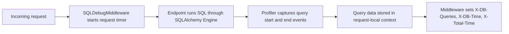

# FastAPI-Silk

<p align="center">
  <strong>Lightweight SQL profiling middleware for FastAPI + SQLAlchemy</strong><br />
  Track query count, database time, and total request time per request.
</p>

<p align="center">
  <a href="https://pypi.org/project/fastapi-silk/">
    
  </a>
  <a href="https://github.com/Nikolaev3Artem/fastapi-silk/actions/workflows/ci.yml">
    
  </a>
  
  <a href="./LICENSE">
    
  </a>
</p>

<p align="center">
  <a href="#installation">Installation</a> |
  <a href="#quick-start">Quick Start</a> |
  <a href="#how-it-works">How It Works</a> |
  <a href="#development">Development</a>
</p>

## Why FastAPI-Silk

| Capability | Details |
| --- | --- |
| SQL instrumentation | Hooks into SQLAlchemy engine events (`before_cursor_execute` / `after_cursor_execute`). |
| Request-level metrics | Adds `X-DB-Queries`, `X-DB-Time`, and `X-Total-Time` response headers. |
| Slow query visibility | Logs queries slower than `0.1s` to stdout for quick diagnostics. |
| Context isolation | Uses `contextvars` for per-request query storage. |
| Minimal setup | One profiler setup call + one middleware registration. |

## Installation

```bash
pip install fastapi-silk
```

PyPI: https://pypi.org/project/fastapi-silk/

## Quick Start

```python
from fastapi import FastAPI
from sqlalchemy import create_engine, text

from fastapi_silk import SQLDebugMiddleware, setup_sql_profiler

app = FastAPI()
engine = create_engine("sqlite:///./app.db")

setup_sql_profiler(engine)
app.add_middleware(SQLDebugMiddleware)


@app.get("/health")
def health() -> dict[str, bool]:
    with engine.connect() as conn:
        conn.execute(text("SELECT 1"))
    return {"ok": True}
```

Example response headers:

```http
X-DB-Queries: 1
X-DB-Time: 0.0012s
X-Total-Time: 0.0049s
```

## How It Works



## Requirements

| Item | Requirement |
| --- | --- |
| Python | `>=3.8` (CI runs `3.10` through `3.14`) |
| Framework | FastAPI |
| Database layer | SQLAlchemy `Engine` |

## Code Convention / Style

- Use **Ruff** for linting and formatting.
- Use **MyPy** (strict mode) for type checks.
- Keep changes small and typed where possible.

## Repository Layout

```text
fastapi-silk/
|- src/fastapi_silk/
|  |- middleware.py
|  |- profiler.py
|  `- storage.py
|- tests/
|  `- profiler/test_profiler.py
|- .github/workflows/
|  |- ci.yml
|  `- publish.yml
|- pyproject.toml
`- Makefile
```

## Development

Install dev dependencies and run checks:

```bash
uv sync --locked --all-extras --dev
make ci
python -m pytest
```

`make ci` runs:
- Ruff lint/format checks
- MyPy strict type checks

## Contributing

1. Create a branch from `development` (for example, `feature/<name>` or `fix/<name>`).
2. Keep the pull request focused on a single change.
3. Add or update tests when behavior changes.
4. Run checks locally (`make ci` and `python -m pytest`).
5. Open a PR with a clear summary of what changed, why, and how it was tested.

## Scope

FastAPI-Silk focuses on SQL profiling and request timing headers.
It does not provide a built-in dashboard UI.

## License

GNU General Public License v3.0 (GPL-3.0). See [LICENSE](./LICENSE).
